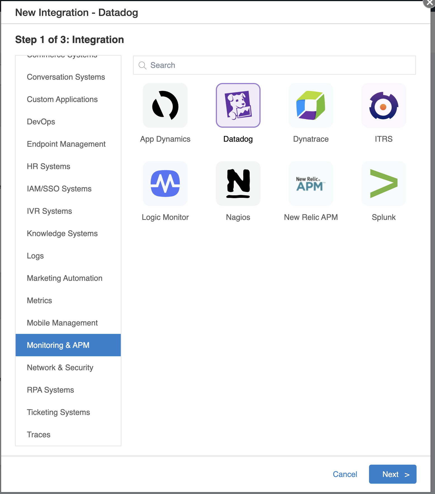
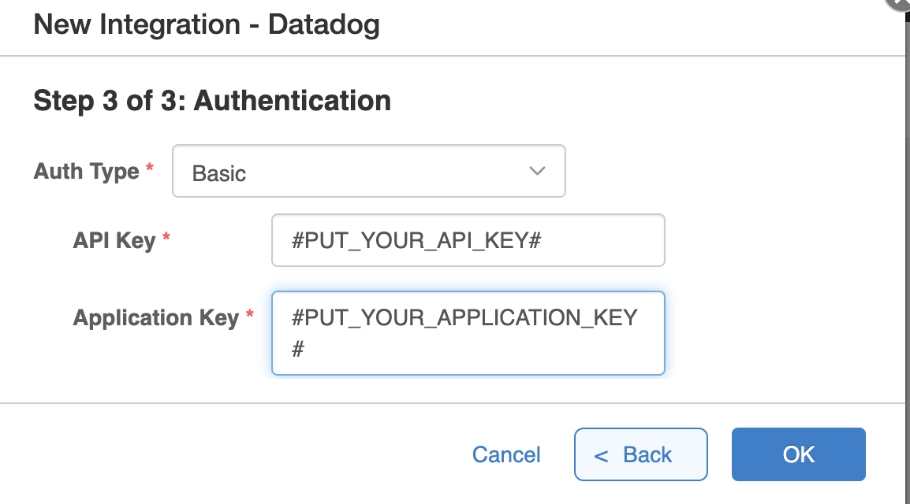
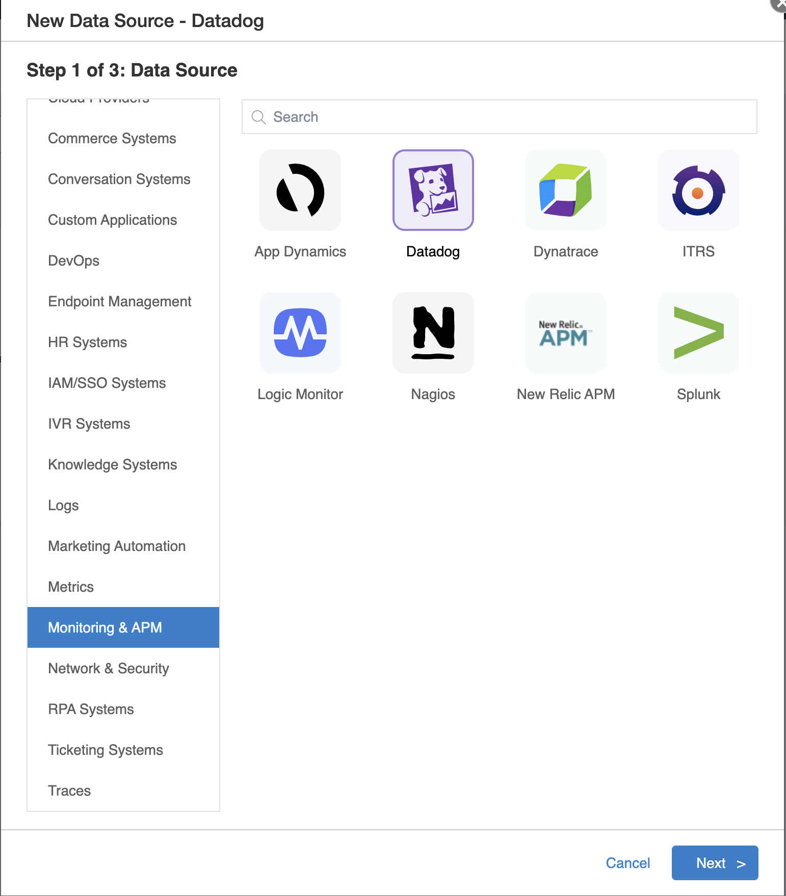
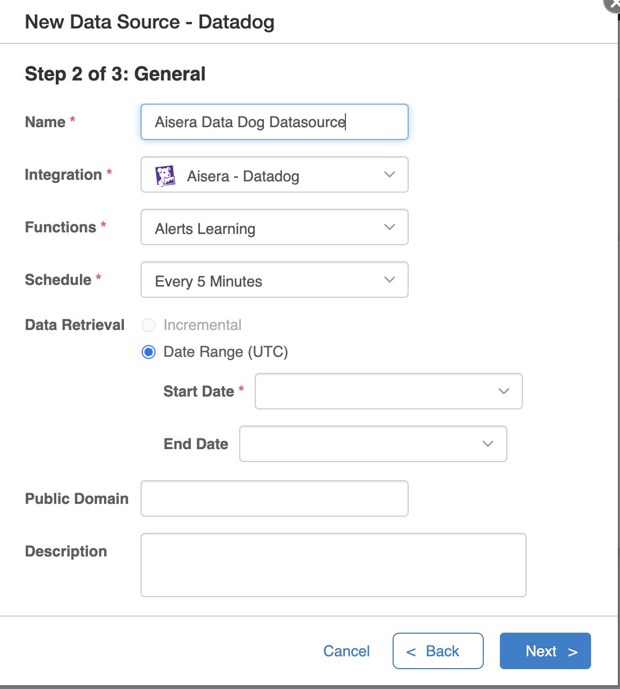
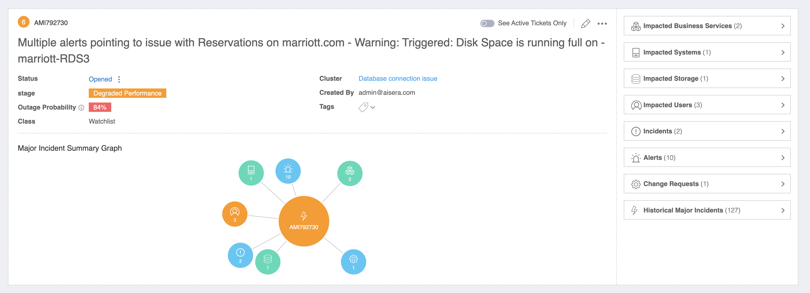
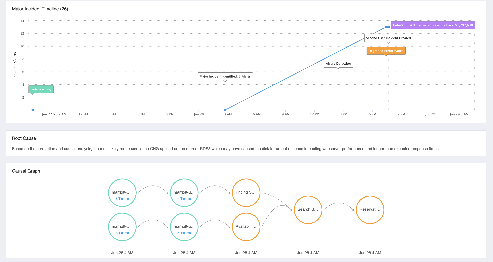
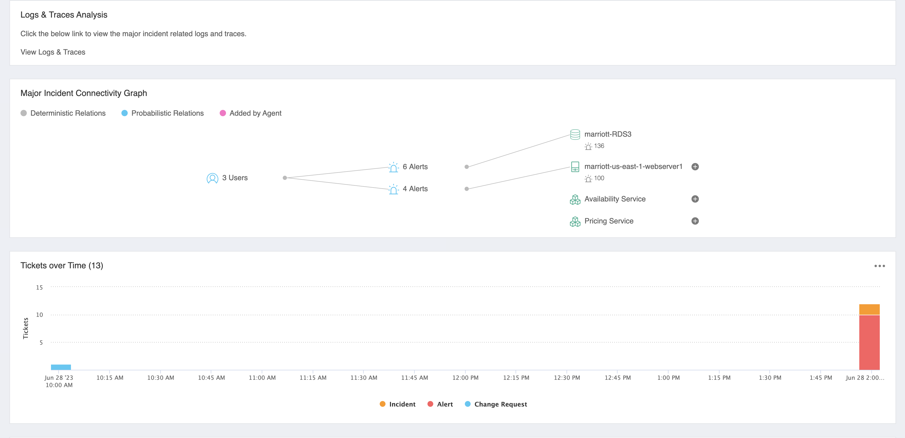
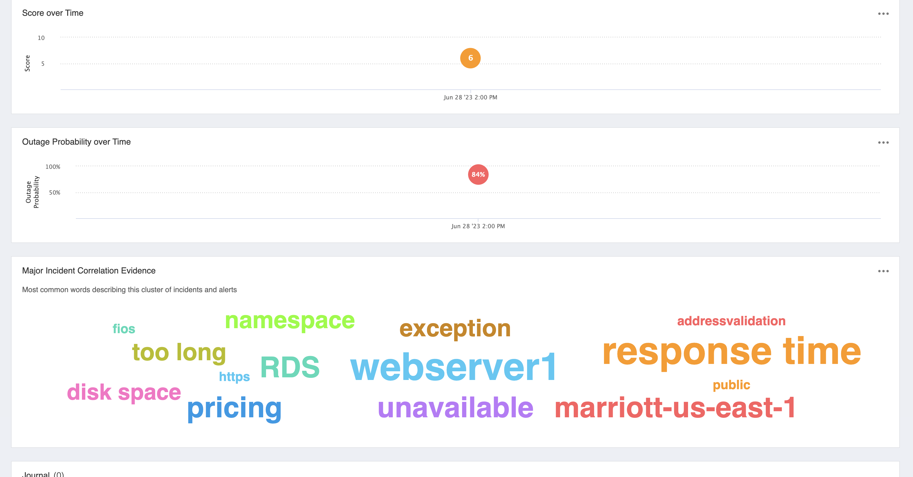

# Agent Check: Aisera

## Overview

 [Aisera's][1] domain-agnostic [AIOps][2] platform identifies complex behaviors and patterns while analyzing correlations and causality on alerts and incidents across applications, services, and systems. 
These advanced capabilities enable accurate prediction of outages and major incidents (MIs) while automating the task to find the root cause and executing runbooks for auto-remediation.

The [Aisera][1] integration enables you to ingest your Datadog alerts/metrics into Aisera.Along with other historical and real-time data across your technology stack, Aisera [AiOps][2] automatically predicts major incidents and delivers proactive notifications in a conversational manner.
## Setup

To set up this integration, please [Contact Us][1] for an Aisera account.
You'll also need Datadog API and Application keys.
### Configuration

1. Create a [Datadog API key][7].
2. Create a Datadog [Datadog application key][8]..
3. Create a Datadog integration using the Datadog API and Application keys in Aisera.
   1. Go to **Settings** > **Integration**.
   2. Click **New Integration**.
   3. In the search bar, select **Datadog**.
      
   4. Enter the **Name**, **API Key** and **Application Key**.
      
   5. Click **OK**. 
4. Create a data source for this integration.
   1. Go to **Settings** > **Data Sources** > **New Data Source**.
   2. In the search bar, select **Integration** in the previous step.
   3. Enter a **Name** and **Schedule** to run the integration.
   4. Select _Alerts Learning_ from **Functions**.
      
      
5. Run the data source. You can also choose to run this data source based on a schedule.
6. Once the alerts have been ingested, Aisera AIOps pipelines will run.
7. AiOps pipelines generate major incidents/clusters based on the category and severity of incidents received.
Each major incident contains the following main components:
      - **Title**: Brief info about the major incident 
      - **Status**: Open/Close  
      - **Cluster**: Aisera generated cluster that this major incident belongs to. 
      - **Outage Probability**: Outage probability for this major incident.
      - **Impacted Business Services**
      - **Impacted Systems**: Infrastructure component impacted by this major incident.
      - **Impacted Storage**: Any DB/Storage that was impacted.
      - **Impacted Users**: Users which are being impacted by this major incident.
      - **Incidents**: Any Incident from ticketing systems that caused this major incident.
      - **Alerts**: Datadog alerts/logs that are part of this major incident.
      - **Change Request**: Any change request which caused this major incident.
      - **Timeline**: A timeline of the incident/alerts correlation.
      - **Root Cause**: A root cause generated by the Aisera LLM model.
      - **Causal Graphs**: Graph of business services.
      - **Logs and Trace Analysis**
      - **Major Incident Connectivity Graph**: A visual representation of how users are impacted by specific alerts/services/infrastructure.
      - **Score over Time**: AMI scores over time.
      - **Outage Probability over Time**
      - **Major Incident Correlation Evidence**
          
          
          
          

Once Aisera detects a major incident:

- It notifies the designated persona on the channel of their choice.
- Aisera creates an incident in Datadog for Datadog Admins to have a visibility of the

Aisera can require approvals before a remediation task can run.

Aisera can also run any remediation task (Any API call/ Shell/Python/Powershell script/ Terraform manifests etc..), leveraging the no-code platform it provides.

## Data Collected

One you run the datasource, Aisera will collect the metrics,alerts and logs  from datadog.

### Service Checks

Aisera does not include any service checks.

### Events

Aisera does not include any events.

## Troubleshooting

Need help? Contact [support@aisera.com](mailto:support@aisera.com).

[1]: https://aisera.com
[2]: https://aisera.com/products/aiops/
[3]: https://docs.datadoghq.com/account_management/api-app-keys/#application-keys
[4]: https://poc0.login.aisera.cloud/#YWlzZXJhLmV4dGVybmFsU3lzdGVtcy5leHRlcm5hbFN5c3RlbXNWaWV3
[5]: https://aisera.com/contact/
[6]: https://github.com/DataDog/integrations-extras/blob/master/aisera/metadata.csv
[7]: https://docs.datadoghq.com/account_management/api-app-keys/#add-an-api-key-or-client-token
[8]: https://docs.datadoghq.com/account_management/api-app-keys/#add-application-keys

