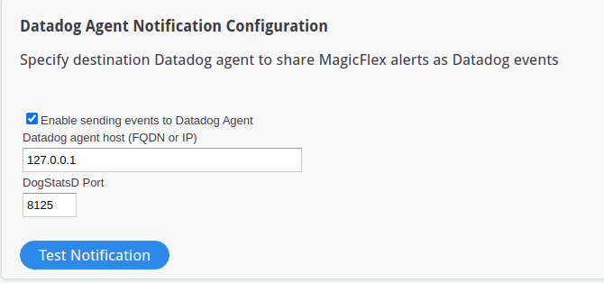
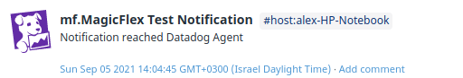
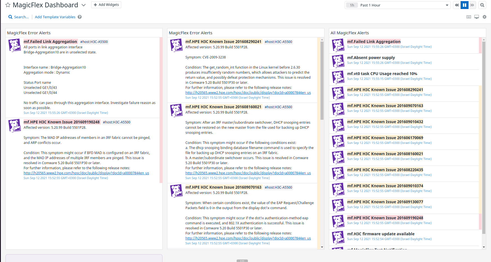

#MagicFlex

## Overview

[MagicFlex][1] is a end-to-end data center analytical solution, complementing Datadog's cloud analysis for hybrid environments, sending proactive alerts so problems can be dealt with before they negatively impact system performance.
 

## Setup

Follow the instructions below to install and configure this integration for a Datadog agent running on a host. For containerized environments, see the [Autodiscovery Integration Templates][2] for guidance on applying these instructions.

### Installation

To install the MagicFlex integration on your host:

1. [Download the Datadog Agent](https://app.datadoghq.com/account/settings#agent).

2. Install the Datadog Agent on a host with connectivity to the MagicFlex Appliance.

### Configuration

1. Check which port DogStatsD is listening. You can check it here: [Datadog Agent DogStatsD Settings](https://docs.datadoghq.com/developers/dogstatsd/)

2. In the MagicFlex appliance Admin Configuration panel, in the Datadog Section, please add the Datadog Agent hostname and DogStatsD port and enable interaction by checking the checkbox.

3. Click "Save" on the top of MagicFlex Configuration Panel

4. You can test the MagicFlex to Datadog integration by clicking the "Test Notification" button. For confirmation, please go to the Datadog Event panel and you'll see test event sent by MagicFlex.

## Data Collected

### Events 

1. You will see MagicFlex alerts in Datadog event panel

2. A "MagicFlex Dashboard" will be available in the Datadog dashboard list which shows all MagicFlex alerts as widgets

## Troubleshooting

Need help? Contact [MagicFlex Support][2].

[1]: http://https://www.magicflexsoftware.com/
[2]: https://www.magicflexsoftware.com/how-to-contact-support
