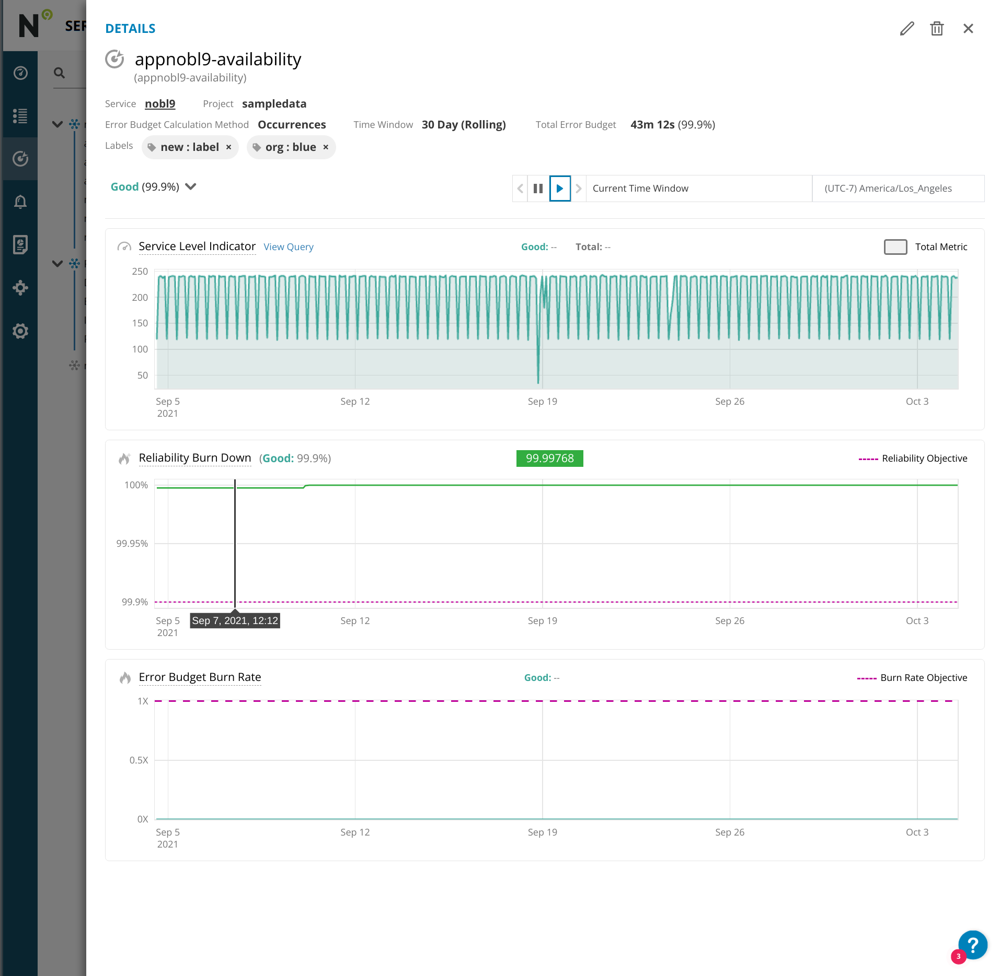
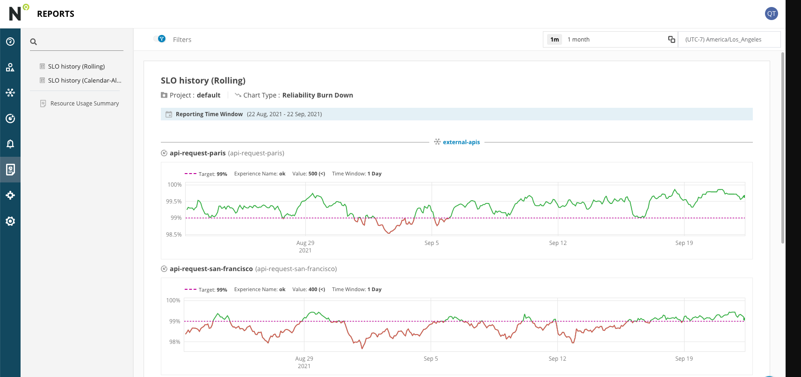
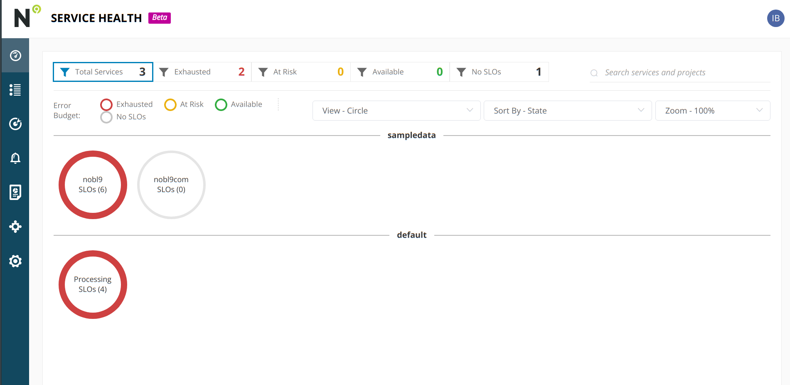

# Nobl9

## Overview
Nobl9 helps you set and understand reliability goals. Nobl9 integrates with
Datadog and other data sources to collect SLI metrics and measure them against
SLO targets. Nobl9 provides real-time and historical SLO reports against the
SLIs, thereby allowing customers to uncover bottlenecks, errors, and issues
faster. Since Nobl9 calculates error budgets of acceptable thresholds, it can
trigger workflows and alerts when the error burn rate is too high or has been
exceeded.

Benefits include:
- **Business Alignment**: Add business context to monitoring data that
optimizes reliability and cost.
- **Standardize Practices**: Define reliability goals, measure those goals,
and improve services.
- **Enable Teams**: Align activities against the priorities set by the
error budget.

### SLO Grid View

### SLO Detail

### SLO Report

### Service Health Dashboard

### Dashboards

## Setup
All configuration happens on the Nobl9 SLO Platform.

1. Add the Datadog API endpoint to connect to your data source (required).
2. Enter a **Project** name. This field is intended for use in situations
where multiple users are spread across multiple teams or projects. When the
field is left blank, a default value appears.
3. The Display Name appears automatically when a name is entered into the
**Name** field.
4. Enter a name for your data source (required). Names are required because metadata names are
unique within each project and are validated against some RFC and DNS names.
The name must contain only lowercase alphanumeric characters and dashes. For
example: `my-datadog-data-source`
5. Enter a description (optional). Add the team or owner details and explain
the purpose of creating this specific data source. Adding a description can
provide immediate context for any team member

More information about creating SLOs on the Nobl9 platform can be found
[here](https://nobl9.github.io/techdocs_User_Guide/#service-level-objectives-38)

## Support
- Email support@nobl9.com
- Website: https://nobl9.com/about/#contact
