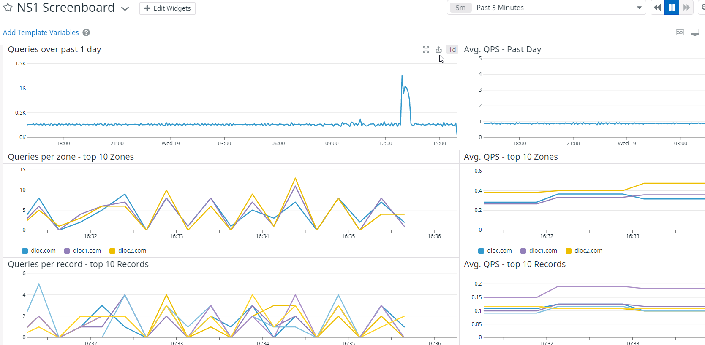

# Agent Check: ns1

## Overview

This check monitors [ns1][1] through the Datadog Agent.



## Setup

Follow the instructions below to install and configure this check for an Agent running on a host. For containerized environments, see the [Autodiscovery Integration Templates][2] for guidance on applying these instructions.

### Installation

See the dedicated Agent guide for [installing community integrations][3]:

1. [Download and launch the Datadog Agent][4].
2. Run the following command to install the integrations wheel with the Agent:

   ```shell
   datadog-agent integration install -t datadog-ns1==0.0.1
   ```
   
3. Configure your integration like [any other packaged integration][5].


### Configuration

1. Edit the `ns1.d/conf.yaml` file, in the `conf.d/` folder at the root of your Agent's configuration directory to start collecting your ns1 performance data. See the [sample ns1.d/conf.yaml](datadog_checks/ns1/data/conf.yaml.example) for all available configuration options.

2. [Restart the Agent][7].

For detailed explanation of all collected performance data see the [NS1 + Datadog Integration][12] article in NS1 help center.

### Validation

[Run the Agent's status subcommand][8] and look for `ns1` under the Checks section.

## Data Collected

### Metrics

See [metadata.csv](metadata.csv) for a list of metrics provided by this check.

### Service Checks

ns1 does not include any service checks.

### Events

ns1 does not include any events.

### Development

Please refer to the [main documentation][10] for more details about how to test and develop Agent based integrations.

To install the ns1 check on your host:

1. Install the [developer toolkit](https://docs.datadoghq.com/developers/integrations/new_check_howto/#developer-toolkit) on any machine.

2. Run `ddev release build ns1` to build the package.

3. [Download the Datadog Agent](https://app.datadoghq.com/account/settings#agent).

4. Upload the build artifact to any host with an Agent and
 run `datadog-agent integration install -w path/to/ns1/dist/<ARTIFACT_NAME>.whl`.

## Troubleshooting

Need help? Contact [Datadog support][11].

[1]: https://ns1.com/
[2]: https://docs.datadoghq.com/agent/kubernetes/integrations/
[3]: https://docs.datadoghq.com/agent/guide/community-integrations-installation-with-docker-agent/?tab=agentabovev68
[4]: https://app.datadoghq.com/account/settings#agent
[5]: https://docs.datadoghq.com/getting_started/integrations/
[6]: https://github.com/DataDog/integrations-extras/blob/master/ns1/datadog_checks/ns1/data/conf.yaml.example
[7]: https://docs.datadoghq.com/agent/guide/agent-commands/#start-stop-and-restart-the-agent
[8]: https://docs.datadoghq.com/agent/guide/agent-commands/#agent-status-and-information
[9]: https://github.com/DataDog/integrations-extras/blob/master/ns1/metadata.csv
[10]: https://docs.datadoghq.com/developers/
[11]: https://docs.datadoghq.com/help/
[12]: https://help.ns1.com/hc/en-us/articles/360020473994-NS1-Datadog-Integration