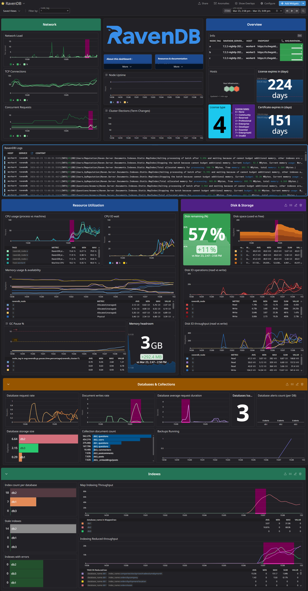

# Agent Check: RavenDB



## Overview

[RavenDB][1] is a NoSQL document-oriented database designed for high performance, scalability, and ease of use. It is optimized for handling JSON-based documents and supports advanced features like ACID transactions, full-text search, and automatic indexing. 
RavenDB is widely used for applications that require high-speed transactions, real-time analytics, and distributed architecture while maintaining data integrity. It is particularly suited for enterprise applications, e-commerce, and real-time monitoring systems.

This integration collects metrics from RavenDB via its Prometheus/OpenMetrics endpoint, enabling visibility into cluster health, node activity, database operations, indexing performance, and resource utilization. These metrics can be used for monitoring, visualization, and alerting within Datadog.

## Setup

### Prerequisites

- [A running RavenDB server (single node or cluster)](https://docs.ravendb.net/start/getting-started)
- [A valid RavenDB license](https://ravendb.net/buy)
- The Datadog Agent installed on each node you want to monitor
- Network access from the Datadog Agent to the RavenDB metrics endpoint


### Installation

To install the RavenDB check on your host:

1. Install the [developer toolkit]
(https://docs.datadoghq.com/developers/integrations/python/)
 on any machine.

2. Run `ddev release build ravendb` to build the package.

3. [Download the Datadog Agent][2].

4. Upload the build artifact to any host with an Agent and
 run `datadog-agent integration install -w
 path/to/ravendb/dist/<ARTIFACT_NAME>.whl`.

### Configuration

#### Metric collection

1. RavenDB is exposing metrics in [Prometheus/OpenMetrics](https://docs.ravendb.net/server/administration/monitoring/prometheus/) format  at an administrative endpoint: `/admin/monitoring/v1/prometheus`.

2. Edit the `ravendb/conf.yaml` file in the `conf.d/` directory of the Datadog Agent. See the [sample ravendb/conf.yaml][4] for all available configuration options.
   Minimal configuration example:
```yaml
   init_config:
   instances:
     - openmetrics_endpoint: "http://localhost:8080/admin/monitoring/v1/prometheus"
```

3. (Optional) Enable additional metric groups:

    Due to their potentially high cardinality, database-, index-, and collection-level metrics are disabled by default. Enabling these metrics may significantly increase the number of time series, especially in environments with many databases, indexes, or collections.
```yaml
   instances:
     - openmetrics_endpoint: "<RAVENDB_METRICS_URL>"
       enable_database_metrics: true
       enable_index_metrics: true
       enable_collection_metrics: true
       enable_gc_metrics: true
```

#### Secured endpoints (TLS)

If the RavenDB metrics endpoint is exposed over HTTPS and requires client authentication, configure TLS options:
```yaml
instances:
  - openmetrics_endpoint: "https://<host>/admin/monitoring/v1/prometheus"
    tls_cert: /path/to/client.crt
    tls_private_key: /path/to/client.key
```
Ensure the Datadog Agent user has read access to the certificate and key files.


#### Cluster deployments

For RavenDB clusters:

- Install and configure the Datadog Agent on each node
- Configure each Agent instance to scrape the local node's metrics endpoint
- Use tags to correlate metrics across nodes and clusters

Example:
```yaml
instances:
  - openmetrics_endpoint: "<RAVENDB_METRICS_URL>"
    tags:
      - ravendb_cluster:my-ravendb-cluster
      - ravendb_node:A
```
#### Log collection (optional)

To collect RavenDB logs, enable log collection in datadog.yaml:

logs_enabled: true

Then add a log configuration to ravendb.d/conf.yaml:
```yaml
logs:
  - type: file
    path: /var/log/ravendb/*.log
    service: ravendb
    source: ravendb

    log_processing_rules:
      - type: multi_line
        name: ravendb_multiline
        pattern: '^\d{4}-\d{2}-\d{2}'

```
Ensure the Datadog Agent user has read permissions on the log files.


### Validation

Run the Agent's status subcommand and look for 'ravendb' under the Checks section.


## Data Collected

### Metrics

See [metadata.csv][7] for a list of metrics provided by this integration.

### Events

The RavenDB integration does not include any events.

## Troubleshooting

Need help? Contact the [maintainer](https://github.com/DataDog/integrations-extras/blob/master/ravendb/manifest.json) of this integration.

[1]: https://ravendb.net
[2]: https://app.datadoghq.com/account/settings/agent/latest
[3]: https://docs.datadoghq.com/containers/kubernetes/integrations/
[4]: https://github.com/DataDog/integrations-extras/blob/master/ravendb/datadog_checks/ravendb/data/conf.yaml.example
[5]: https://docs.datadoghq.com/agent/configuration/agent-commands/#start-stop-and-restart-the-agent
[6]: https://docs.datadoghq.com/agent/configuration/agent-commands/#agent-status-and-information
[7]: https://github.com/DataDog/integrations-extras/blob/master/ravendb/metadata.csv
[9]: https://docs.datadoghq.com/help/

