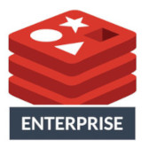
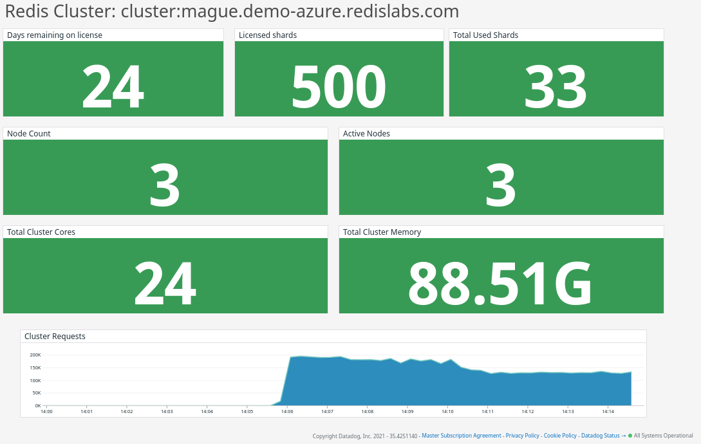
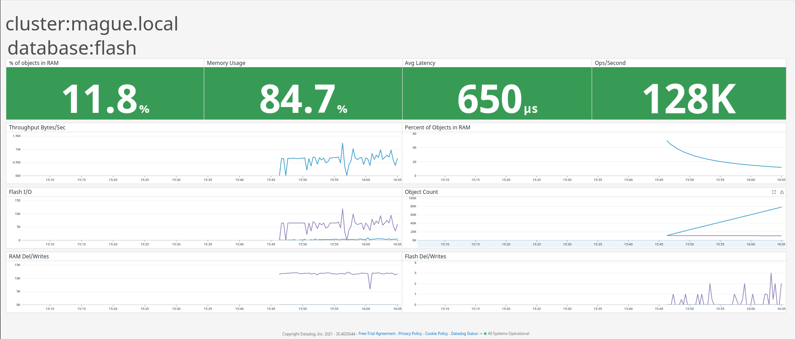
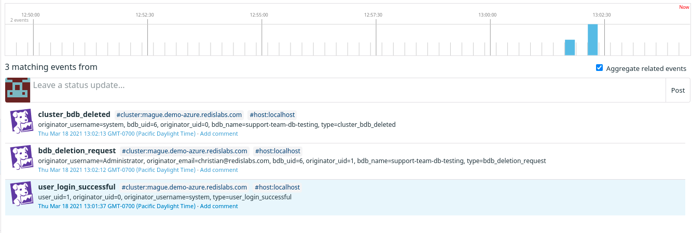

# Redis Enterprise



## Overview

This integration provides [Redis Enterprise][1] monitoring and metrics for Datadog.

### What is Redis Enterprise?

[Redis Enterprise][1] is the fully supported mission critical ready version of Redis, the most loved database in the world.  In addition to the core open source Redis feature set, Redis Enterprise adds active-active geo-distribution, multi-model database features, enhanced observability and easier multi-tenancy management for higher uptimes.

### Redis Enterprise Datadog Dashboard

Redis Enterprise's Datadog integration provides a templated view across your clusters and databases allowing for operational insight unavailable in other products.  Understand usage patterns and plan for growth armed with the data necessary to make informed decisions.

#### Database Overview


#### Cluster Overview


#### Redis on Flash


#### Redis Enterprise Events



### Provider


This integration is provided by Redis Labs.


## Setup

Copy the [sample configuration][2] and update the required sections to collect data from your Redis Enterprise cluster

```yml
    ## @param host - string - required
    ## The RedisEnterprise host
    #
    host: myrediscluster.example.com

    ## @param user - string - required
    ## The RedisEnterprise API user
    #
    user: redisadmin@example.com

    ## @param password - string - required
    ## The RedisEnterprise API credential
    #
    password: mySecretPassword
```

See the full example file for other optional settings available to match your cluster configuration.

## Data Collected

### Metrics

See [metadata.csv][3] for a list of metrics provided by this integration and the description of each.

### Service Checks

RedisEnterprise does not provide any service checks

### Events

All [Redis Enterprise events][4] are collected.

## Troubleshooting

Contact the [Redis Enterprise Support Team][5]


[1]: http://www.redislabs.com
[2]: https://github.com/DataDog/integrations-extras/blob/master/redisenterprise/datadog_checks/redisenterprise/data/conf.yaml.example
[3]: https://github.com/DataDog/integrations-extras/blob/master/redisenterprise/metadata.csv
[4]: https://docs.redislabs.com/latest/rs/administering/monitoring-metrics/#cluster-alerts
[5]: https://redislabs.com/deployment/support/

