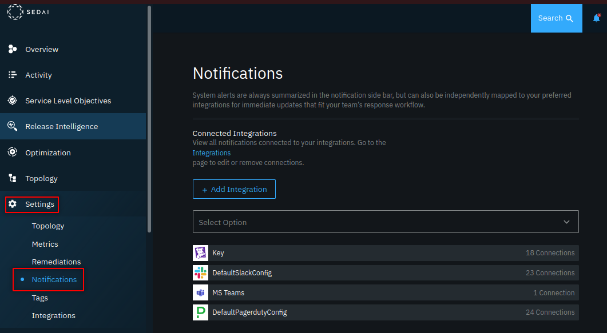
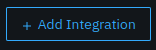
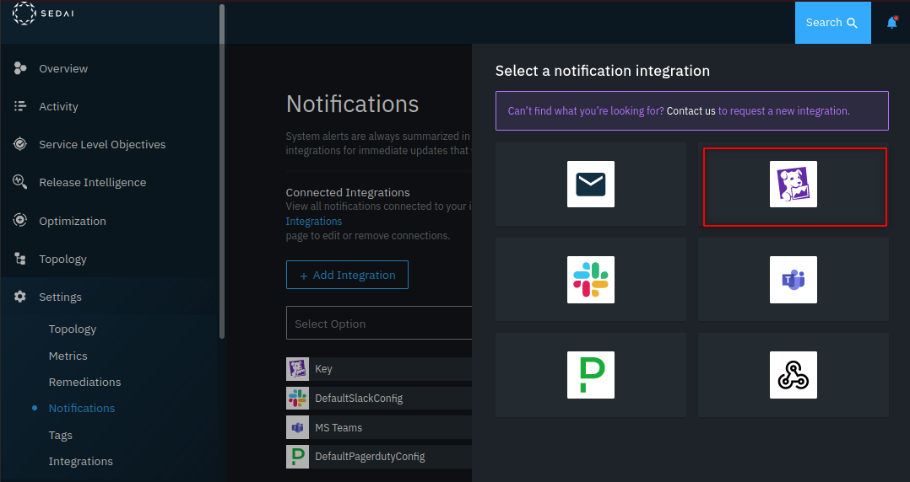
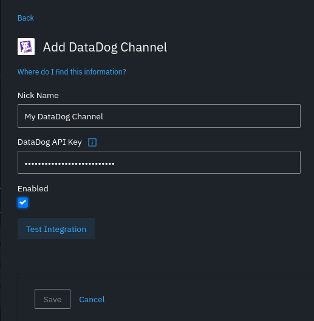
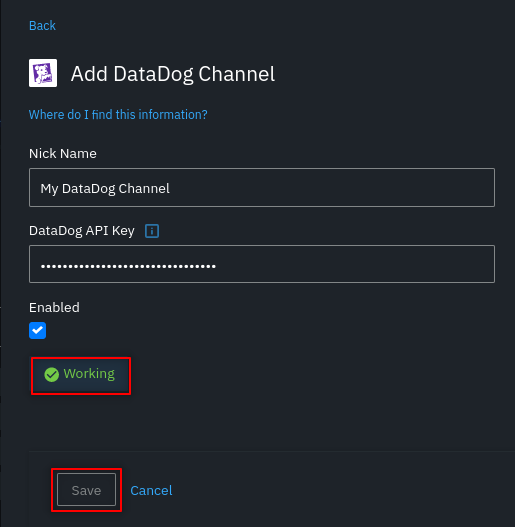
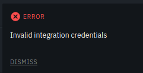

## Overview

Sedai: Continuous Autonomous Availability Management (CAAM) proactively manages your cloud environments through autonomous actions that prevent availability issues and optimize your resources’ performance in production. Our agentless, configuration-free platform infers and adapts to your cloud environments' observed performance.

From preventing downtime and managing SLOs to analyzing code releases and lowering cloud costs, Sedai is the autonomous platform for your SRE and DevOps teams. As a Sedai customer, you can directly integrate with Datadog to receive select notifications in your dashboards.

**Unlock the full potential of your microservices:**
* Achieve 99.99% or better application availability
* Autonomously reduce resource latency by 75%
* Reduce cloud costs by 30% through autonomous optimization
* Increase team productivity and agility by 3x

### Core Features

* **Easy setup:** Sedai's agentless approach integrates with your cloud accounts and observability platforms so you can get up and running in minutes.
* **Configuration-free:** By inferring your topology and metrics, Sedai leverages them to detect signals based on observed performance.
* **Autonomous Availability:** Prevent issues and ensure the highest levels of availability with autonomous actions.
* **Release Intelligence:** Validate release performance in production in real-time with smart scorecards that assess the quality of your deployments and analyze deviations in latency and errors.
* **Resource Optimization:** Improve customer experience and lower cloud costs on the fly with dynamic allocation that manages your resources based on traffic needs.
* **Smart SLOs:** In addition to automatically analyzing and defining targets, Sedai manages error budgets with autonomous actions that prevent errors, downtime, and SLO breaches.

To learn more, see [Sedai Inc.][1]

## Setup
As an existing Sedai customer you may integrate your environment with your DataDog dashboard.

Notifications are alerts related to the events and the updates happening in your Sedai system that can be displayed on your DataDog dashboard as *Events*.

**To access the notifications page:**

From the **Settings** menu, click **Notifications**.

The Notifications page is displayed.

Click the `+ Add Integration` button to add a new notification integration.

Click the **DataDog** icon from the **Select a notification integration** pop-out.

The **Add DataDog Channel** popup will be available:

Enter a **Nick Name** to identify the channel.

Copy-and-paste your **DataDog API Key** into the input field.

Check the **Enabled** check-box if you would like messages from Sedai to immediately start appearing as *DataDog Events* on your DataDog dashboard.

Then click the **Test Integration** button to ensure that your DataDog API Key has been entered correctly.

You should see **Working** replace the *Test Integration* button and you can now click the **Save** button to store the channel configuration:

If you see the **Invalid credentials** message:

There is an error in the **DataDog API Key** that should be corrected before testing the integration again.

### Filtering Notifications

There is a default set of notification types that will appear as events on your DataDog dashboard, instructions on how to add or remove notification types that will trigger sending events to DataDog are available in the [Sedai documentation][2].

## Data Collected

### Metrics

This integration does not collect metrics.

### Events

This integration does not support events.

### Service

This integration does not collect service checks.

## Support

Need help? Email [Support][3] is available 24/7.

Alternatively, [contact us][4] to schedule a demo or a free 14-day trial.

[1]: https://www.sedai.io
[2]: https://sedai.gitbook.io/sedai/sedai-user-guide/controls/notifications
[3]: mailto:support@sedai.io
[4]: https://www.sedai.io/contact
