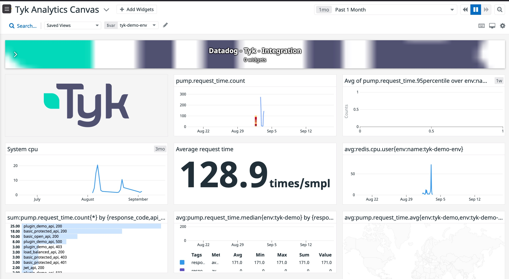

# Agent Check: tyk

## Overview


This check collects metrics from [Tyk-gateway][https://github.com/TykTechnologies/tyk].
Tyk gateway can record for you all the traffic that it's processing in various depth levels. 
We call these records *analytics*. You can send these analytics to various data sinks among which is Datadog.
With Datadog, you can easily create a nice dashboard that displays statistics about your API services.
Here's an example for such dashboard:


You can import the above dashboard with this [file](./assets/dashboards/tyk_analytics_canvas.json) and using 
it as an example or baseline for your own dashboard.

### How does it work behind the scenes

[Tyk][1] wrote custom application metrics and gets them into Datadog by sending them to [DogStatsD][9], 
a metrics aggregation service bundled with the Datadog Agent. DogStatsD implements the StatsD 
protocol and adds a few Datadog-specific extensions including the Histogram metric type, that is 
in use by `Tyk-gateway`.

`Tyk-gateway` is using `Tyk-pump` to send the analytics it generated to Datadog.
When running the Datadog Agent, StatsDogD gets `request_time` metric from `Tyk-pump` in real time, per request, 
so you can understand the usage of your apis and get the flexibility of aggregating by various parameters such 
as date, version, returned code, method etc.
The custom matric Tyk is using is of type [DD_HISTOGRAM_AGGREGATES](https://docs.datadoghq.com/agent/docker/?tab=standard#dogstatsd-custom-metrics) 


## Setup

As explain above, Tyk's integration is included in the `tyk-pump` package, so you only need to set 
configuration in the `pump.conf` (and no need to install anything on your Tyk platform) 

### Installation

#### **Install tyk**: 
For this integration you need to have a running Tyk installation. You can install 
[Tyk self managed](https://tyk.io/docs/tyk-self-managed/install/) or 
[Tyk OSS](https://tyk.io/docs/apim/open-source/installation/). Both options include the `tyk-pump`.

#### **Install Datadog Agent**: 
Install the [Datadog Agent](https://app.datadoghq.com/account/settings#agent) in your environment. 
You can run Datadog [agent](https://docs.datadoghq.com/agent/) in your k8s cluster, as a 
docker container, on your mac or any other way you choose as long as `Tyk pump` will be able to access it. 


### Configuration

#### Setup *Tyk-pump*: 
To set a Datadog pump follow the instructions in this [link](https://github.com/TykTechnologies/tyk-pump#dogstatsd)
Here is an example of Datadog pump configuration in `pump.conf`. 
This [example](https://github.com/TykTechnologies/tyk-demo/blob/master/deployments/analytics-datadog/volumes/tyk-pump/pump-datadog.conf)  
was taken from `Tyk-demo` project (which provides an example installation of Tyk)

``` json
pump.conf:
...
   "dogstatsd": {
      "type": "dogstatsd",
      "meta": {
        "address": "dd-agent:8126",
        "namespace": "tyk",
        "async_uds": true,
        "async_uds_write_timeout_seconds": 2,
        "buffered": true,
        "buffered_max_messages": 32,
        "sample_rate": 0.9999999999,
        "tags": [
          "method",
          "response_code",
          "api_version",
          "api_name",
          "api_id",
          "org_id",
          "tracked",
          "path",
          "oauth_id"
        ]
      }
    },
```

#### **Setup Datadog Agent**: 
Tyk's integration makes use of StatsdogD. `Tyk-pump` writes over UDP to StatsdogD that is part of the agent.
Please set up the following Datadog environment variables in your environment:

| DD Environment variable   |  Value           | Description |
|---------------------------|:-------------:|------:|
| DD_API_KEY | {your-datadog-api-key} | For the DD agent to connect the DD portal. Use this [link](https://app.datadoghq.com/account/settings#api) to get the key |
| DD_ENV |    tyk-demo-env   |   To set environment name |
| DD_DOGSTATSD_TAGS | "env:tyk-demo" |  Additional tags to append to all metrics, events, and service checks received by this DogStatsD server |
| DD_LOGS_ENABLED | true | For the DD agent to enable logs collection |
| DD_LOGS_CONFIG_CONTAINER_COLLECT_ALL | true | To skip the DD logs |
| DD_DOGSTATSD_SOCKET | /var/run/docker.sock | Path to the Unix socket to listen to.  Docker compose mounts this path |
| DD_DOGSTATSD_ORIGIN_DETECTION | true | Enable container detection and tagging for unix socket metrics |
| DD_DOGSTATSD_NON_LOCAL_TRAFFIC | true | Listen to DogStatsD packets from other containers (required to send custom metrics) |
| DD_AGENT_HOST | dd-agent | Name of the agent host in docker |
| DD_AC_EXCLUDE | redis | To exclude DD redis checks |
| DD_CONTAINER_EXCLUDE | true | To exclude docker checks for the DD agent|

This is the [doc](https://docs.datadoghq.com/developers/dogstatsd/?tab=hostagent#setup) to set up the agent.

[Restart the Agent][4] after setting the environment variables


### Validation

Create a dashboard (or import our sample) and add a widget. In the secsion `Graph your data` under the `matric` 
option, start typing the namespace you chose for the pump in the config `pump.conf` under `dogstatsd.namespace`. 
In the example above it was `tyk`. Once you start typing you will see all the available matrics - `tyk.request_time.avg` etc.

## Data Collected

### Metrics

See [metadata.csv][6] for a list of metrics provided by this check.

### Dashboards

### Events

The tyk integration does not include any events ATM but you can add them on your own.

### Service Checks

The tyk integration does not include any service checks.

## Troubleshooting

Need help? Contact [Datadog support][8].


[1]: https://tyk.io/
[2]: https://docs.datadoghq.com/agent/kubernetes/integrations/
[3]: https://github.com/DataDog/integrations-extras/blob/master/tyk/datadog_checks/tyk/data/conf.yaml.example
[4]: https://docs.datadoghq.com/agent/guide/agent-commands/#start-stop-and-restart-the-agent
[5]: https://docs.datadoghq.com/agent/guide/agent-commands/#agent-status-and-information
[6]: https://github.com/DataDog/integrations-extras/blob/master/tyk/metadata.csv
[8]: https://docs.datadoghq.com/help/
[9]: https://docs.datadoghq.com/developers/dogstatsd/?tab=hostagent#pagetitle
