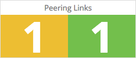
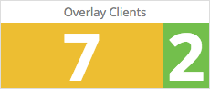
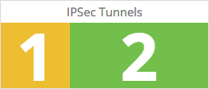

## Overview

Get state information regarding your VNS3 topology's IPSec endpoints/tunnels, VNS3 Peers, and overlay clients.

*   Peering links Status Check:

    

*   Overlay Clients Status Check:

    

*   IPSec tunnels Status Check:

    

## Configuration

To capture metrics, you need to deploy Cohesive Networks' DataDog container, set up the VNS3 firewall, and configure the container.

Read the guide [here](https://cohesive.net/dnld/Cohesive-Networks_VNS3-DataDog-Container-Guide.pdf).

Watch the video [here](https://youtu.be/sTCgCG3m4vk).
